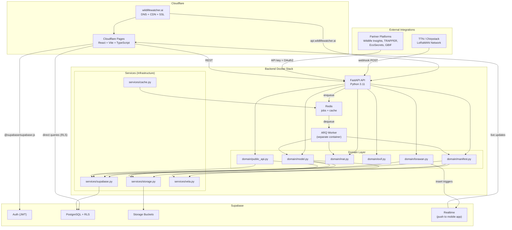
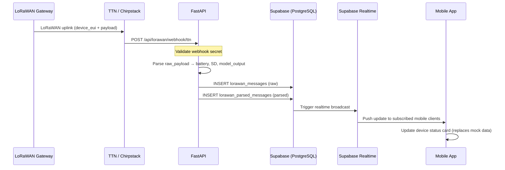
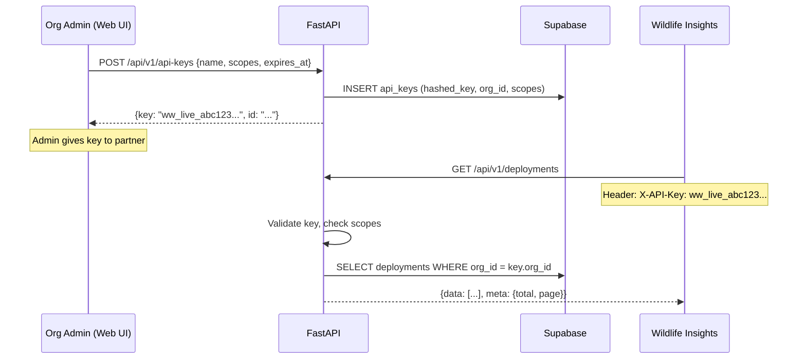

# 🧭 Wildlife Watcher — V2 Architecture & Execution Plan

## 🎯 Core Philosophy

V2 shifts from **"modular rewrite"** to **"production-ready platform with async processing, resilience, and safe rollout"**.

| Principle | What It Means |
|-----------|--------------|
| ✅ Async job system from Day 1 | No long-running HTTP requests. Every heavy operation returns a `job_id` |
| ✅ Strong error handling + retries | Exponential backoff on all external calls. Structured error responses |
| ✅ Observability | JSON logs, request IDs, Sentry, latency metrics |
| ✅ Security hardening | Rate limiting, file validation, signed URLs, minimal service-role usage |
| ✅ Incremental migration | Parallel rollout. Streamlit stays in prod while V2 runs on `beta.` subdomain |

---

## Current System Inventory

### Files to Migrate

| File | Lines | What It Does | Migrates To |
|------|-------|-------------|-------------|
| [app.py](file:///C:/Users/VictorAnton/Wildlife-Watcher/ww-website/app.py) | 1950 | All UI + all business logic in one file | Split across API domain + routers + frontend |
| [db_utils.py](file:///C:/Users/VictorAnton/Wildlife-Watcher/ww-website/db_utils.py) | 38 | `fetch_all_rows()` paginated Supabase query | Backend utility (shared) |
| [exif_parser.py](file:///C:/Users/VictorAnton/Wildlife-Watcher/ww-website/exif_parser.py) | 185 | EXIF extraction from JPEG bytes | Frontend (exifr) default, API fallback |
| [scripts/deploy_models.py](file:///C:/Users/VictorAnton/Wildlife-Watcher/ww-website/scripts/deploy_models.py) | 173 | CI script to deploy models | Stays as CLI script |
| [scripts/convert_github_model.py](file:///C:/Users/VictorAnton/Wildlife-Watcher/ww-website/scripts/convert_github_model.py) | ~100 | Converts GitHub model source | Stays as CLI script |
| [scripts/export_data.py](file:///C:/Users/VictorAnton/Wildlife-Watcher/ww-website/scripts/export_data.py) | ~150 | Exports data as CSV | Stays as CLI script |
| [.devcontainer/](file:///C:/Users/VictorAnton/Wildlife-Watcher/ww-website/.devcontainer/devcontainer.json) | 33 | Codespaces config (Streamlit) | Update for new stack |
| [.github/workflows/deploy-models.yml](file:///C:/Users/VictorAnton/Wildlife-Watcher/ww-website/.github/workflows/deploy-models.yml) | 42 | CI for model deployment | Keep, add new deployment workflows |

### Functional Features (from app.py)

| # | Feature | Lines | Auth? | Server-Side? | V2 Job Type |
|---|---------|-------|-------|-------------|-------------|
| 1 | **Download Firmware/Models** — MANIFEST.zip assembly | 1232–1578 | Optional | **Yes** | `generate_manifest_job` |
| 2 | **Upload/Convert Model** — Vela conversion → upload | 1582–1706 | Required | **Yes** | `convert_model_job` |
| 3 | **Export Data** — projects/deployments/devices → CSV | 1708–1840 | Required | No | Frontend direct |
| 4 | **Analyze Images** — EXIF + deployment cross-ref | 1842–1950 | Required | Partially | Frontend (exifr) + Supabase query |
| 5 | **Authentication** — login, roles, org listing | 855–1000 | — | No | Frontend (Supabase JS) |
| 6 | **iNaturalist OAuth** (Stage 1) | implemented | Required | **Yes** | Sync (OAuth exchange) — `/api/inat/*` |
| 7 | **Image Clustering** (Stage 2A) | implemented | Required | **Yes** | Sync — `/api/clustering/analyze` |
| 8 | **iNat Upload + Poll** (Stage 2B) | implemented | Required | **Yes** | Sync — `/api/inat/observations/*` |
| 9 | **MegaDetector** (future) | future | Required | **Yes** | `megadetector_job` |
| 10 | **🆕 LoRaWAN Webhook Ingestion** — receive uplinks from TTN/Chirpstack/Helium, parse battery/SD/model output, push to mobile app via Supabase Realtime | new | Webhook secret | **Yes** | Sync (fast insert) |
| 11 | **🆕 Public Data API** — external camera trap platforms (Wildlife Insights, TRAPPER, EcoSecrets) query deployment data, device telemetry, CamtrapDP export | new | API key + OAuth2 scopes | **Yes** | Sync (reads) + `camtrapdp_export_job` |

### Registries / Constants (from app.py L32-97)

```python
MODEL_REGISTRY       # 4 models: Person Detection, YOLOv8 OD, YOLOv11 OD, YOLOv8 Pose
CAMERA_CONFIGS        # 2 configs: Raspberry Pi, HM0360
GENERAL_ORG_ID        # b0000000-0000-0000-0000-000000000001
```

---

## 🧱 V2 Architecture

### High-Level Diagram



### 🆕 Three New Layers (vs V1)

#### 1. Domain Layer

Separates business logic from HTTP concerns and infrastructure:

```
routers/manifest.py       ← HTTP/validation only, thin
    ↓
domain/manifest.py        ← business logic, orchestration
    ↓
services/storage.py       ← infrastructure (Supabase, S3, HTTP)
services/vela.py          ← infrastructure (Vela binary)
```

**Why**: Routers become trivially testable. Domain logic is reusable by both the API handler (sync for small requests) and the worker (async for heavy jobs). Services can be mocked independently.

#### 2. Job System (ARQ + Redis — Phase 1, not deferred)

```python
# backend/app/jobs/definitions.py
from arq import func

async def convert_model_job(ctx, file_path: str, user_id: str, org_id: str, ...):
    """Long-running model conversion. Executed by the worker, not the API process."""
    from app.domain.model import ModelDomain
    domain = ModelDomain()
    result = await domain.convert_and_upload(file_path, user_id, org_id, ...)
    return result

async def generate_manifest_job(ctx, request_hash: str, params: dict):
    """Assemble MANIFEST.zip. May take 10-30s depending on downloads."""
    from app.domain.manifest import ManifestDomain
    domain = ManifestDomain()
    result_path = await domain.generate(params)
    return {"download_url": result_path}

# Register jobs
JOBS = [
    func(convert_model_job, name="convert_model"),
    func(generate_manifest_job, name="generate_manifest"),
]
```

#### 3. Worker Service (separate container)

```dockerfile
# backend/Dockerfile — worker target
FROM base AS worker
CMD ["arq", "app.jobs.worker.WorkerSettings"]
```

Runs the same codebase but only processes queued jobs. Can be scaled independently.

---

## 🔌 API Design (V2)

### Async-First Endpoints

Heavy operations no longer return results directly. They return a `job_id` for polling.

| V1 (original plan) | V2 (async) |
|---|---|
| `POST /api/models/convert` → returns ZIP | `POST /api/models/convert` → returns `{job_id}` |
| `POST /api/manifest/generate` → returns ZIP | `POST /api/manifest/generate` → returns `{job_id}` |
| — | `GET /api/jobs/{id}` → status + progress |
| — | `GET /api/jobs/{id}/result` → download |

> [!NOTE]
> Small/fast operations (EXIF parsing, SSCMA catalog listing) remain synchronous.

### 📦 Standard Response Envelope

**Success:**
```json
{
  "data": { "job_id": "abc123", "status": "queued" },
  "meta": { "request_id": "req-xyz-789" }
}
```

**Error:**
```json
{
  "error": {
    "code": "MODEL_CONVERSION_FAILED",
    "message": "Vela compiler returned exit code 1",
    "retryable": true,
    "details": "ethos-u-vela: unsupported operator BatchMatMulV2"
  },
  "meta": { "request_id": "req-xyz-789" }
}
```

### Job Status Model

```json
{
  "job_id": "abc123",
  "status": "processing",
  "progress": 0.6,
  "created_at": "2026-04-12T03:00:00Z",
  "result_url": null,
  "error": null
}
```

Status values: `queued` → `processing` → `completed` | `failed`

### Complete Endpoint Map

| Streamlit Function | V2 Endpoint | Method | Auth | Async? | Response |
|---|---|---|---|---|---|
| `create_manifest_package()` | `/api/manifest/generate` | POST | Optional | **Yes** | `{job_id}` |
| `process_github_model()` | `/api/models/pretrained` | POST | No | **Yes** | `{job_id}` |
| `process_sscma_model()` | `/api/models/sscma` | POST | No | **Yes** | `{job_id}` |
| `fetch_sscma_models()` | `/api/models/sscma/catalog` | GET | No | No | `{data: [...]}` (cached) |
| `run_conversion()` | `/api/models/convert` | POST | Yes | **Yes** | `{job_id}` |
| `upload_and_register_model()` | `/api/models/upload` | POST | Yes | **Yes** | `{job_id}` |
| — | `/api/jobs/{id}` | GET | Yes | — | `{status, progress, result_url}` |
| — | `/api/jobs/{id}/result` | GET | Yes | — | `StreamingResponse(ZIP)` or signed URL |
| EXIF parsing | `/api/exif/parse` | POST | No | No | `{data: [...]}` |
| iNat OAuth start | `/api/inat/auth/start` | GET | Yes | No | `{redirect_url}` |
| iNat OAuth callback | `/api/inat/auth/callback` | GET | — | No | `{success}` |
| iNat clustering | `/api/inat/cluster` | POST | Yes | **Yes** | `{job_id}` |
| iNat upload reps | `/api/inat/upload` | POST | Yes | **Yes** | `{job_id}` |
| MegaDetector | `/api/ml/megadetector` | POST | Yes | **Yes** | `{job_id}` |
| Health check | `/health` | GET | No | No | `{status: "ok"}` |

#### 🆕 LoRaWAN Webhook Endpoints

| Endpoint | Method | Auth | Description |
|---|---|---|---|
| `/api/lorawan/webhook/ttn` | POST | Webhook secret (header) | Receive TTN uplinks |
| `/api/lorawan/webhook/chirpstack` | POST | Webhook secret (header) | Receive Chirpstack uplinks |
| `/api/lorawan/webhook/generic` | POST | Webhook secret (header) | Receive generic LoRaWAN uplinks |
| `/api/lorawan/messages` | GET | JWT (user) | List LoRaWAN messages for user's org/project |
| `/api/lorawan/messages/{device_eui}/latest` | GET | JWT (user) | Latest parsed message (battery, SD, model output) |
| `/api/lorawan/devices/{device_eui}/telemetry` | GET | JWT (user) | Time-series telemetry (battery, SD over time) |

#### 🆕 Public Data API Endpoints

| Endpoint | Method | Auth | Description |
|---|---|---|---|
| `/api/v1/deployments` | GET | API key | List deployments (filter by project, date range, status) |
| `/api/v1/deployments/{id}` | GET | API key | Single deployment with device + location data |
| `/api/v1/devices` | GET | API key | List devices in org |
| `/api/v1/devices/{id}/telemetry` | GET | API key | LoRaWAN telemetry history |
| `/api/v1/observations` | GET | API key | AI detections from LoRaWAN messages |
| `/api/v1/export/camtrapdp` | POST | API key | Export deployment data as CamtrapDP package |
| `/api/v1/api-keys` | POST | JWT (org admin) | Create/revoke API keys for organisation |
| `/api/v1/api-keys` | GET | JWT (org admin) | List active API keys |

---

## Project Structure (V2)

```
ww-website/
├── frontend/                              # React (Vite + TypeScript)
│   ├── public/
│   │   └── favicon.ico
│   ├── src/
│   │   ├── main.tsx
│   │   ├── App.tsx
│   │   ├── routes.tsx
│   │   ├── config/
│   │   │   ├── supabase.ts                # Supabase JS client init
│   │   │   └── api.ts                     # API base URL, feature flags
│   │   ├── lib/
│   │   │   ├── apiClient.ts               # Centralized fetch: auth headers, retries, error parsing
│   │   │   ├── queryClient.ts             # TanStack Query config
│   │   │   └── toast.ts                   # Global toast/notification system
│   │   ├── hooks/
│   │   │   ├── useAuth.ts                 # Supabase auth hook
│   │   │   ├── useJob.ts                  # Poll job status via TanStack Query
│   │   │   ├── useOrganizations.ts
│   │   │   └── useModels.ts
│   │   ├── services/
│   │   │   ├── manifestApi.ts             # POST /api/manifest/generate → poll job
│   │   │   ├── modelApi.ts                # POST /api/models/convert → poll job
│   │   │   ├── exportApi.ts               # Direct Supabase queries → CSV
│   │   │   └── inatApi.ts                 # iNat OAuth flow
│   │   ├── pages/
│   │   │   ├── LandingPage.tsx            # Hero, features, how-it-works
│   │   │   ├── ToolkitPage.tsx            # Tabbed: Download│Upload│Export│Analyze
│   │   │   ├── DocsPage.tsx
│   │   │   └── AboutPage.tsx
│   │   ├── components/
│   │   │   ├── layout/
│   │   │   │   ├── Navbar.tsx
│   │   │   │   ├── Footer.tsx
│   │   │   │   └── AppShell.tsx
│   │   │   ├── toolkit/
│   │   │   │   ├── DownloadFirmware.tsx
│   │   │   │   ├── UploadModel.tsx
│   │   │   │   ├── ExportData.tsx
│   │   │   │   └── AnalyzeImages.tsx
│   │   │   ├── auth/
│   │   │   │   ├── LoginForm.tsx
│   │   │   │   └── AuthGuard.tsx
│   │   │   └── common/
│   │   │       ├── FileDropzone.tsx
│   │   │       ├── JobProgress.tsx        # 🆕 Progress bar with polling
│   │   │       ├── ErrorBanner.tsx         # 🆕 Retryable errors
│   │   │       └── StatusBadge.tsx
│   │   ├── styles/
│   │   │   ├── index.css                  # Design tokens from mobile theme.ts
│   │   │   └── components.css
│   │   └── types/
│   │       └── index.ts
│   ├── index.html
│   ├── vite.config.ts
│   ├── tsconfig.json
│   └── package.json
│
├── backend/                               # FastAPI (Python 3.11)
│   ├── app/
│   │   ├── __init__.py
│   │   ├── main.py                        # FastAPI app, CORS, lifespan, middleware
│   │   ├── config.py                      # Pydantic BaseSettings, all env vars
│   │   ├── dependencies.py                # Supabase client factory, JWT auth, rate limiter
│   │   │
│   │   ├── middleware/                     # 🆕 Cross-cutting concerns
│   │   │   ├── __init__.py
│   │   │   ├── request_id.py              # Inject X-Request-ID into every request/response
│   │   │   ├── logging.py                 # Structured JSON request/response logging
│   │   │   └── rate_limit.py              # Per-IP + per-user rate limiting
│   │   │
│   │   ├── routers/                       # HTTP layer — thin, validation only
│   │   │   ├── __init__.py
│   │   │   ├── manifest.py                # POST /api/manifest/generate → enqueue job
│   │   │   ├── models.py                  # POST /api/models/convert, /upload → enqueue
│   │   │   ├── jobs.py                    # 🆕 GET /api/jobs/{id}, GET /api/jobs/{id}/result
│   │   │   ├── exif.py                    # POST /api/exif/parse (sync, small payload)
│   │   │   ├── inat.py                    # GET /api/inat/auth/*, POST /api/inat/*
│   │   │   ├── lorawan.py                 # 🆕 POST /api/lorawan/webhook/*, GET /api/lorawan/messages
│   │   │   ├── public_api.py              # 🆕 /api/v1/* — external partner access
│   │   │   └── ml.py                      # POST /api/ml/megadetector (future)
│   │   │
│   │   ├── domain/                        # 🆕 Business logic — no HTTP, no infra
│   │   │   ├── __init__.py
│   │   │   ├── manifest.py                # Orchestrates: fetch config → fetch model → assemble ZIP
│   │   │   ├── model.py                   # Orchestrates: validate → convert → upload → register
│   │   │   ├── exif.py                    # Parse EXIF, extract deployment ID
│   │   │   ├── inat.py                    # OAuth flow, clustering, upload, polling
│   │   │   ├── lorawan.py                 # 🆕 Parse uplinks, match device_eui → device, store
│   │   │   └── public_api.py              # 🆕 Scoped data access, CamtrapDP export logic
│   │   │
│   │   ├── services/                      # Infrastructure adapters
│   │   │   ├── __init__.py
│   │   │   ├── storage.py                 # Download/upload from Supabase Storage (with retries)
│   │   │   ├── supabase_client.py         # Client factories (anon, user, service-role)
│   │   │   ├── vela.py                    # Vela compiler wrapper (subprocess)
│   │   │   ├── http_client.py             # httpx with retry + timeout config
│   │   │   ├── cache.py                   # 🆕 Redis cache (SSCMA catalog, manifests)
│   │   │   ├── api_key.py                 # 🆕 API key generation, validation, scoping
│   │   │   └── db_utils.py                # fetch_all_rows() paginated query
│   │   │
│   │   ├── jobs/                          # 🆕 Async job definitions + worker
│   │   │   ├── __init__.py
│   │   │   ├── definitions.py             # convert_model_job, generate_manifest_job, etc.
│   │   │   ├── worker.py                  # ARQ WorkerSettings
│   │   │   └── store.py                   # Job status read/write (Redis-backed)
│   │   │
│   │   ├── schemas/                       # Pydantic models (renamed from models/ to avoid confusion)
│   │   │   ├── __init__.py
│   │   │   ├── manifest.py                # ManifestRequest
│   │   │   ├── model.py                   # ModelConvertRequest, ModelUploadRequest
│   │   │   ├── job.py                     # 🆕 JobStatus, JobResult
│   │   │   ├── lorawan.py                 # 🆕 TTNUplink, ChirpstackUplink, ParsedMessage
│   │   │   ├── public_api.py              # 🆕 DeploymentOut, DeviceOut, ApiKeyCreate
│   │   │   └── common.py                  # ApiResponse, ApiError envelope
│   │   │
│   │   └── registries/
│   │       ├── __init__.py
│   │       ├── model_registry.py          # MODEL_REGISTRY (from app.py L32-78)
│   │       └── camera_configs.py          # CAMERA_CONFIGS (from app.py L82-93)
│   │
│   ├── tests/
│   │   ├── conftest.py                    # Shared fixtures, mock Redis/Supabase
│   │   ├── test_manifest_domain.py
│   │   ├── test_model_domain.py
│   │   ├── test_exif_domain.py
│   │   ├── test_jobs.py
│   │   └── test_routers.py                # Integration tests via httpx TestClient
│   │
│   ├── Dockerfile                         # Multi-stage: base, dev, worker
│   ├── requirements.txt
│   ├── requirements-dev.txt
│   └── pyproject.toml
│
├── scripts/                               # CLI tools (unchanged)
│   ├── convert_github_model.py
│   ├── deploy_models.py
│   ├── download_models.py
│   └── export_data.py
│
├── docker-compose.yml                     # API + Worker + Redis + (optional frontend)
├── docker-compose.dev.yml                 # Dev overrides (hot reload)
├── docker-compose.full.yml                # Fully self-hosted (+ local Supabase + MinIO)
├── .env.example
├── .github/
│   └── workflows/
│       ├── deploy-models.yml              # Existing
│       ├── deploy-backend.yml             # 🆕 Build + push Docker → Render/Railway
│       └── deploy-frontend.yml            # 🆕 Build → Cloudflare Pages
├── .devcontainer/
│   └── devcontainer.json                  # Updated for new stack
└── README.md
```

---

## ⚙️ Backend V2 Details

### 1. Auth Flow (JWT Passthrough)

Frontend uses `@supabase/supabase-js` for auth. API calls include the JWT as `Authorization: Bearer <token>`. FastAPI validates:

```python
# backend/app/dependencies.py
from fastapi import Depends, HTTPException, Header
from app.services.supabase_client import create_anon_client, create_service_client

async def get_current_user(authorization: str = Header(...)):
    """Validate Supabase JWT. Returns user object or 401."""
    if not authorization.startswith("Bearer "):
        raise HTTPException(status_code=401, detail="Invalid auth header")
    token = authorization.replace("Bearer ", "")
    client = create_anon_client()
    user_response = client.auth.get_user(token)
    if not user_response or not user_response.user:
        raise HTTPException(status_code=401, detail="Invalid or expired token")
    return user_response.user

async def get_user_client(authorization: str = Header(...)):
    """Supabase client authenticated as the requesting user (RLS applies)."""
    token = authorization.replace("Bearer ", "")
    client = create_anon_client()
    client.auth.set_session(access_token=token, refresh_token="")
    return client

async def get_privileged_client():
    """Service-role client for admin operations. Use sparingly."""
    return create_service_client()
```

### 2. Retry Strategy

All external calls use exponential backoff:

```python
# backend/app/services/http_client.py
import httpx
from tenacity import retry, stop_after_attempt, wait_exponential, retry_if_exception_type

@retry(
    stop=stop_after_attempt(3),
    wait=wait_exponential(multiplier=1, min=1, max=10),
    retry=retry_if_exception_type((httpx.TimeoutException, httpx.HTTPStatusError)),
)
async def download_with_retry(url: str) -> bytes:
    async with httpx.AsyncClient(timeout=30.0) as client:
        response = await client.get(url)
        response.raise_for_status()
        return response.content
```

Applied to: Supabase Storage downloads, GitHub model downloads, SSCMA catalog fetch, iNat API calls.

### 3. File Handling Constraints

```python
# backend/app/routers/models.py
from fastapi import UploadFile, HTTPException

MAX_UPLOAD_SIZE = 50 * 1024 * 1024  # 50 MB
ALLOWED_MIME_TYPES = {"application/zip", "application/x-zip-compressed"}

async def validate_upload(file: UploadFile):
    # MIME check
    if file.content_type not in ALLOWED_MIME_TYPES:
        raise HTTPException(400, detail=f"Invalid file type: {file.content_type}")
    
    # Size check (read in chunks)
    size = 0
    chunks = []
    async for chunk in file:
        size += len(chunk)
        if size > MAX_UPLOAD_SIZE:
            raise HTTPException(413, detail=f"File exceeds {MAX_UPLOAD_SIZE // 1024 // 1024}MB limit")
        chunks.append(chunk)
    
    # ZIP structure validation
    content = b"".join(chunks)
    if not content[:4] == b'PK\x03\x04':
        raise HTTPException(400, detail="File is not a valid ZIP archive")
    
    return content
```

### 4. Security Hardening

| Measure | Implementation |
|---------|---------------|
| **Rate limiting** | `slowapi` — per-IP (60/min anon, 120/min auth) + per-user |
| **Signed URLs** | Job results use time-limited signed URLs from Supabase Storage |
| **Service role minimization** | Only used for manifest config download + model upload. Never exposed to frontend |
| **CORS strict** | `ALLOWED_ORIGINS` env var, no wildcards in production |
| **Input validation** | Pydantic schemas on all endpoints. File size + MIME + ZIP structure checks |
| **Request IDs** | UUID4 injected via middleware, propagated to logs + error responses |

### 5. Caching Layer

```python
# backend/app/services/cache.py
import redis.asyncio as redis
import json
from app.config import settings

_redis: redis.Redis | None = None

async def get_redis() -> redis.Redis:
    global _redis
    if not _redis:
        _redis = redis.from_url(settings.REDIS_URL)
    return _redis

async def cached(key: str, ttl: int, fetch_fn):
    """Cache-aside pattern. Returns cached value or fetches + caches."""
    r = await get_redis()
    cached_val = await r.get(key)
    if cached_val:
        return json.loads(cached_val)
    result = await fetch_fn()
    await r.set(key, json.dumps(result), ex=ttl)
    return result
```

| What's Cached | TTL | Key |
|--------------|-----|-----|
| SSCMA model catalog | 1 hour | `sscma:catalog` |
| Generated manifests (by input hash) | 15 min | `manifest:{hash}` |
| GitHub model downloads | 1 hour | `github-model:{type}:{res}` |
| Config firmware metadata | 5 min | `firmware:latest-config` |

### 6. Observability

#### Structured Logging

```python
# backend/app/middleware/logging.py
import structlog
import time
from starlette.middleware.base import BaseHTTPMiddleware

logger = structlog.get_logger()

class LoggingMiddleware(BaseHTTPMiddleware):
    async def dispatch(self, request, call_next):
        request_id = request.state.request_id  # Set by RequestIDMiddleware
        start = time.monotonic()
        
        response = await call_next(request)
        
        duration = time.monotonic() - start
        logger.info(
            "request_completed",
            request_id=request_id,
            method=request.method,
            path=request.url.path,
            status=response.status_code,
            duration_ms=round(duration * 1000, 2),
            user_id=getattr(request.state, "user_id", None),
        )
        return response
```

#### Metrics to Track

| Metric | Source |
|--------|--------|
| Request latency (p50, p95, p99) | Logging middleware |
| Job queue depth | Redis `LLEN` |
| Job duration by type | Worker logging |
| Job failure rate | Worker logging + Sentry |
| Cache hit rate | Cache service |

#### Error Tracking

- **Sentry** (Python SDK + React SDK)
- Unhandled exceptions auto-captured
- Request ID attached to Sentry events for correlation

---

## 🎨 Frontend V2 Details

### 1. State Management: TanStack Query

```bash
npm install @tanstack/react-query
```

Handles caching, retries, loading states, and job polling automatically:

```tsx
// frontend/src/hooks/useJob.ts
import { useQuery } from "@tanstack/react-query";
import { apiClient } from "../lib/apiClient";

export function useJob(jobId: string | null) {
  return useQuery({
    queryKey: ["job", jobId],
    queryFn: () => apiClient.get(`/api/jobs/${jobId}`),
    enabled: !!jobId,
    refetchInterval: (query) => {
      const status = query.state.data?.data?.status;
      if (status === "completed" || status === "failed") return false;
      return 2000; // Poll every 2s while active
    },
  });
}
```

### 2. Centralized API Client

```tsx
// frontend/src/lib/apiClient.ts
import { supabase } from "../config/supabase";

const BASE_URL = import.meta.env.VITE_API_BASE_URL;

async function request(path: string, options: RequestInit = {}) {
  const session = await supabase.auth.getSession();
  const token = session.data?.session?.access_token;

  const response = await fetch(`${BASE_URL}${path}`, {
    ...options,
    headers: {
      "Content-Type": "application/json",
      ...(token ? { Authorization: `Bearer ${token}` } : {}),
      ...options.headers,
    },
  });

  const body = await response.json();

  if (!response.ok) {
    const error = body.error || { code: "UNKNOWN", message: "Request failed" };
    throw new ApiError(error.code, error.message, error.retryable);
  }

  return body;
}

export const apiClient = {
  get: (path: string) => request(path),
  post: (path: string, data?: any) => request(path, { method: "POST", body: JSON.stringify(data) }),
  upload: (path: string, formData: FormData) =>
    request(path, { method: "POST", body: formData, headers: {} }),
};
```

### 3. EXIF Optimization

```tsx
// Default: browser-side parsing (no API call needed)
import exifr from "exifr";

async function parseExif(file: File) {
  try {
    const data = await exifr.parse(file, { xmp: true, icc: false });
    return data;
  } catch {
    // Fallback: server-side for custom EXIF tags
    const formData = new FormData();
    formData.append("files", file);
    return apiClient.upload("/api/exif/parse", formData);
  }
}
```

### 4. Error UX System

Global toast notifications for consistent error handling + retry buttons for retryable errors:

```tsx
// frontend/src/components/common/ErrorBanner.tsx
export function ErrorBanner({ error, onRetry }: { error: ApiError; onRetry?: () => void }) {
  return (
    <div className="error-banner" role="alert">
      <span>{error.message}</span>
      {error.retryable && onRetry && (
        <button onClick={onRetry}>Retry</button>
      )}
    </div>
  );
}
```

### 5. Frontend → Supabase Direct (no API needed)

| Feature | Supabase Query |
|---------|---------------|
| List user's organizations | `from('user_roles')...` → `from('organisations')...` |
| List org's AI models | `from('ai_models').select('*').eq('organisation_id', orgId)` |
| Export projects/deployments/devices | Paginated `from('...')` → CSV via `papaparse` |
| Deployment cross-reference | `from('deployments').select('*, projects(name), devices(name, bluetooth_id)')` |
| Auth login/logout | `supabase.auth.signInWithPassword()` / `signOut()` |

---

## 🐳 Docker Configuration (V2)

### docker-compose.yml

```yaml
version: "3.9"

services:
  # --- API Server ---
  api:
    build:
      context: ./backend
      target: base
    ports:
      - "8000:8000"
    environment:
      - SUPABASE_URL=${SUPABASE_URL}
      - SUPABASE_ANON_KEY=${SUPABASE_ANON_KEY}
      - SUPABASE_SERVICE_ROLE_KEY=${SUPABASE_SERVICE_ROLE_KEY}
      - REDIS_URL=redis://redis:6379
      - ALLOWED_ORIGINS=${ALLOWED_ORIGINS:-https://wildlifewatcher.ai,http://localhost:5173}
      - SENTRY_DSN=${SENTRY_DSN:-}
      - LOG_LEVEL=${LOG_LEVEL:-info}
    depends_on:
      redis:
        condition: service_healthy
    healthcheck:
      test: ["CMD", "python", "-c", "import urllib.request; urllib.request.urlopen('http://localhost:8000/health')"]
      interval: 30s
      timeout: 5s
      retries: 3
    restart: unless-stopped

  # --- 🆕 Worker (async jobs) ---
  worker:
    build:
      context: ./backend
      target: worker
    environment:
      - SUPABASE_URL=${SUPABASE_URL}
      - SUPABASE_ANON_KEY=${SUPABASE_ANON_KEY}
      - SUPABASE_SERVICE_ROLE_KEY=${SUPABASE_SERVICE_ROLE_KEY}
      - REDIS_URL=redis://redis:6379
      - SENTRY_DSN=${SENTRY_DSN:-}
      - LOG_LEVEL=${LOG_LEVEL:-info}
    depends_on:
      redis:
        condition: service_healthy
    restart: unless-stopped

  # --- 🆕 Redis (jobs + cache) ---
  redis:
    image: redis:7-alpine
    ports:
      - "6379:6379"
    volumes:
      - redis-data:/data
    healthcheck:
      test: ["CMD", "redis-cli", "ping"]
      interval: 10s
      timeout: 3s
      retries: 3
    restart: unless-stopped

  # --- Frontend (self-hosted only; Cloudflare Pages handles this in cloud) ---
  frontend:
    build:
      context: ./frontend
      args:
        VITE_SUPABASE_URL: ${SUPABASE_URL}
        VITE_SUPABASE_ANON_KEY: ${SUPABASE_ANON_KEY}
        VITE_API_BASE_URL: ${API_BASE_URL:-http://localhost:8000}
    ports:
      - "80:80"
    depends_on:
      api:
        condition: service_healthy
    restart: unless-stopped

volumes:
  redis-data:
```

### docker-compose.dev.yml

```yaml
version: "3.9"
services:
  api:
    build:
      target: dev
    volumes:
      - ./backend/app:/app/app
    environment:
      - ALLOWED_ORIGINS=http://localhost:5173
      - LOG_LEVEL=debug

  worker:
    build:
      target: dev
    volumes:
      - ./backend/app:/app/app
    environment:
      - LOG_LEVEL=debug
```

### docker-compose.full.yml (Fully Self-Hosted / Offline)

```yaml
version: "3.9"
services:
  supabase-db:
    image: supabase/postgres:15.6.1.117
    ports:
      - "54322:5432"
    environment:
      POSTGRES_PASSWORD: ${POSTGRES_PASSWORD:-postgres}
    volumes:
      - supabase-db-data:/var/lib/postgresql/data

  minio:
    image: minio/minio
    ports:
      - "9000:9000"
      - "9001:9001"
    environment:
      MINIO_ROOT_USER: minioadmin
      MINIO_ROOT_PASSWORD: minioadmin
    command: server /data --console-address ":9001"
    volumes:
      - minio-data:/data

volumes:
  supabase-db-data:
  minio-data:
```

### Backend Dockerfile (Multi-Stage)

```dockerfile
FROM python:3.11-slim AS base

RUN apt-get update && apt-get install -y --no-install-recommends \
    build-essential && rm -rf /var/lib/apt/lists/*

WORKDIR /app
COPY requirements.txt .
RUN pip install --no-cache-dir -r requirements.txt
COPY app/ ./app/

EXPOSE 8000
HEALTHCHECK --interval=30s --timeout=5s --retries=3 \
    CMD python -c "import urllib.request; urllib.request.urlopen('http://localhost:8000/health')"
CMD ["uvicorn", "app.main:app", "--host", "0.0.0.0", "--port", "8000", "--workers", "2"]

# --- Dev target ---
FROM base AS dev
COPY requirements-dev.txt .
RUN pip install --no-cache-dir -r requirements-dev.txt
CMD ["uvicorn", "app.main:app", "--host", "0.0.0.0", "--port", "8000", "--reload"]

# --- Worker target ---
FROM base AS worker
CMD ["arq", "app.jobs.worker.WorkerSettings"]
```

---

## ☁️ Cloudflare Deployment

### Frontend → Cloudflare Pages

1. Cloudflare Dashboard → **Workers & Pages** → **Create** → **Pages** → **Connect to Git**
2. Root directory: `frontend` | Build: `npm run build` | Output: `dist` | Preset: Vite
3. Env vars: `VITE_SUPABASE_URL`, `VITE_SUPABASE_ANON_KEY`, `VITE_API_BASE_URL`
4. **Custom Domain** → `wildlifewatcher.ai` (auto SSL)

### Backend → Docker Host

| Host | Cost | Notes |
|------|------|-------|
| **Render** | Free–$7/mo | Easiest. Redis add-on available |
| **Railway** | ~$5/mo | Fast, built-in Redis |
| **Fly.io** | Free tier | Global edge, good for API |
| **Hetzner VPS** | €4/mo | Cheapest 24/7, self-managed |

### DNS (Cloudflare Dashboard)

```
TYPE    NAME    TARGET                              PROXY
CNAME   @       <auto-managed by Cloudflare Pages>  ✅
CNAME   www     wildlifewatcher.ai                  ✅
CNAME   api     your-api.onrender.com               ✅
CNAME   beta    <beta Render instance>              ✅    (Phase 4)
```

SSL: **Full (Strict)**

---

## 🚀 Phased Execution Plan

### 🟢 Phase 0 — Stabilize Current (1 day)

> Get `wildlifewatcher.ai` pointing to the existing Streamlit app today.

- [ ] Deploy Streamlit to Render as Docker container
- [ ] Cloudflare DNS CNAME `wildlifewatcher.ai` → Render URL
- [ ] Enable WebSocket support in Cloudflare (Streamlit needs it)
- [ ] Verify all 4 modes work through the custom domain
- [ ] **This becomes the reliability baseline** — any regression is visible

✅ **Deliverable**: `wildlifewatcher.ai` is live with Streamlit

---

### 🔵 Phase 1 — Backend Core + Jobs (4-5 days)

> FastAPI scaffold with async job system, domain layer, and production-grade infrastructure from Day 1.

- [ ] **Scaffold FastAPI** in `backend/`
  - `main.py` — CORS, lifespan (Redis connect/disconnect), middleware registration
  - `config.py` — Pydantic `BaseSettings` with all env vars
  - `dependencies.py` — JWT validation, Supabase client factories, rate limiter
- [ ] **Middleware stack**
  - Request ID middleware (UUID4 per request)
  - Structured JSON logging middleware
  - Rate limiting (`slowapi`)
- [ ] **Standard response envelope** — `ApiResponse`, `ApiError` Pydantic models
- [ ] **Redis + ARQ setup**
  - Redis connection in lifespan
  - `jobs/worker.py` — ARQ WorkerSettings
  - `jobs/store.py` — read/write job status in Redis
  - `jobs/definitions.py` — `convert_model_job`, `generate_manifest_job`
  - `routers/jobs.py` — `GET /api/jobs/{id}`, `GET /api/jobs/{id}/result`
- [ ] **Domain layer** — business logic separated from routers
  - `domain/manifest.py` ← from `app.py` L1232-1578
  - `domain/model.py` ← from `app.py` L430-574, L1007-1171, L1582-1706
  - `domain/exif.py` ← from `exif_parser.py`
- [ ] **Services (infrastructure)**
  - `services/storage.py` ← `download_from_storage()`, `download_url_content()` with retries
  - `services/vela.py` ← Vela subprocess wrapper
  - `services/http_client.py` ← httpx with tenacity retry
  - `services/cache.py` ← Redis cache-aside pattern
  - `services/supabase_client.py` ← client factories
  - `services/db_utils.py` ← `fetch_all_rows()`
- [ ] **Registries** — `MODEL_REGISTRY`, `CAMERA_CONFIGS` as Python modules
- [ ] **Routers** — `manifest.py`, `models.py`, `exif.py` (thin, delegate to domain)
- [ ] **LoRaWAN webhook receiver** (scaffolding)
  - `routers/lorawan.py` — `POST /api/lorawan/webhook/ttn`, `/chirpstack`, `/generic`
  - `domain/lorawan.py` — parse raw payload → match `device_eui` → insert `lorawan_messages` + `lorawan_parsed_messages`
  - `schemas/lorawan.py` — `TTNUplink`, `ChirpstackUplink`, `ParsedMessage` Pydantic models
  - Webhook secret validation via `X-Webhook-Secret` header or TTN's `X-Downlink-Apikey`
  - Supabase Realtime propagates inserts to mobile app (replaces [MockLoRaWANService](file:///c:/dev/ww/src/services/MockLoRaWANService.ts))
- [ ] **Dockerfile** (multi-stage: base, dev, worker) + `requirements.txt`
- [ ] **Tests** — domain unit tests + router integration tests

✅ **Deliverable**: working API at `api.wildlifewatcher.ai/docs` with async jobs + LoRaWAN ingestion, deployed to Render

---

### 🟣 Phase 2 — Frontend Core (5-7 days)

> React + Vite with TanStack Query, job polling, and the full toolkit UI.

- [ ] **Scaffold Vite + React + TypeScript** in `frontend/`
- [ ] **TanStack Query** setup (`queryClient.ts`)
- [ ] **API client** — centralized fetch with auth headers, retries, error parsing
- [ ] **Design system** — CSS variables matching mobile app theme:
  - Primary: `rgb(0, 110, 28)` (light) / `rgb(76, 175, 80)` (dark) from [theme.ts](file:///c:/dev/ww/src/theme.ts)
  - Dark mode support
- [ ] **Layout** — `AppShell`, `Navbar`, `Footer`
- [ ] **Landing page** — hero section, feature cards, CTA
- [ ] **Auth** — `LoginForm` (Supabase JS), `AuthGuard`
- [ ] **Job polling UI** — `useJob` hook, `JobProgress` component
- [ ] **Error UX** — global toast system, `ErrorBanner` with retry
- [ ] **Toolkit page** (tabbed interface):
  - **Download Firmware** — submit → job progress → download ZIP
  - **Upload Model** — dropzone → convert job → upload job → success
  - **Export Data** — Supabase direct queries → CSV via `papaparse`
  - **Analyze Images** — `exifr` browser-side → results table → Supabase cross-ref
- [ ] **Cloudflare Pages config** + GitHub Actions workflow

✅ **Deliverable**: usable frontend at `beta.wildlifewatcher.ai`

---

### 🟡 Phase 3 — Reliability & Security (2-3 days)

> Harden everything before real users touch it.

- [ ] **Rate limiting** tuned (per-IP + per-user limits)
- [ ] **File validation** — size limits, MIME check, ZIP structure validation
- [ ] **Retry logic** verified — exponential backoff on all external calls
- [ ] **Caching** — SSCMA catalog, GitHub model downloads, config firmware metadata
- [ ] **Sentry** integration (Python + React SDKs)
- [ ] **Metrics** — request latency, job duration, failure rate, cache hit rate
- [ ] **Security review** — CORS config, service-role key usage audit, signed URLs for results

✅ **Deliverable**: observability dashboard, security checklist passed

---

### 🟠 Phase 4 — Parallel Run (CRITICAL)

> Run both systems simultaneously. No big-bang switchover.

- [ ] **Streamlit stays at `wildlifewatcher.ai`** (production)
- [ ] **V2 runs at `beta.wildlifewatcher.ai`** (beta)
- [ ] **Feature parity checklist**:

| Feature | Streamlit | V2 Beta | Parity? |
|---------|-----------|---------|---------|
| Download pre-trained model | ✅ | ☐ | |
| Download SSCMA model | ✅ | ☐ | |
| Download org model (auth) | ✅ | ☐ | |
| Upload/convert model | ✅ | ☐ | |
| Export data CSV | ✅ | ☐ | |
| Analyze images (EXIF) | ✅ | ☐ | |
| Login/logout | ✅ | ☐ | |
| Role-based access | ✅ | ☐ | |

- [ ] **Feature flags** (per environment, via env vars):
  - `FF_INAT_ENABLED=false` — iNaturalist integration
  - `FF_ML_ENABLED=false` — MegaDetector
  - `FF_CLUSTERING_ENABLED=false` — image clustering
- [ ] **User testing** — invite 2-3 users to beta, collect feedback
- [ ] **Automated smoke tests** — CI runs equivalent operations on both systems

✅ **Deliverable**: V2 beta validated with real users, parity confirmed

---

### 🔴 Phase 5 — Cutover (1-2 days)

> Gradually switch traffic. Rollback-ready.

- [ ] Move `wildlifewatcher.ai` DNS to Cloudflare Pages (V2 frontend)
- [ ] Move `api.wildlifewatcher.ai` to V2 backend
- [ ] Keep Streamlit available at `legacy.wildlifewatcher.ai` (30 days)
- [ ] **Monitor**: error rates, job completion rates, user feedback
- [ ] **Rollback plan**: DNS switch back to Streamlit takes < 5 min (Cloudflare TTL)
- [ ] After 30 days stable: decommission Streamlit, archive `app.py`

✅ **Deliverable**: V2 is production, Streamlit archived

---

### ⚫ Phase 6 — Advanced Features (ongoing)

> Enable feature flags one at a time.

- [ ] **iNaturalist Integration** (Phase 4 from [inaturalist_integration.md](file:///C:/Users/VictorAnton/Wildlife-Watcher/ww-website/inaturalist_integration.md))
  - iNat OAuth router
  - Token persistence (encrypted in Supabase)
  - Stage 2A: clustering service
  - Stage 2B: upload reps + poll results
- [ ] **MegaDetector**
  - GPU-aware Docker image (CUDA)
  - `megadetector_job` in ARQ worker
  - Deploy GPU worker to Cloud Run or separate VPS
- [ ] **Interactive deployment map** — Leaflet/Mapbox showing deployment locations

---

#### 🆕 LoRaWAN Webhook Ingestion (Phase 1 scaffolding → Phase 6 advanced)

> Replaces [MockLoRaWANService.ts](file:///c:/dev/ww/src/services/MockLoRaWANService.ts) with real data from TTN/Chirpstack/Helium.

**Architecture:**



**Webhook payload parsing:**

The domain layer normalizes different network server formats into a common internal representation:

```python
# backend/app/domain/lorawan.py

class LoRaWANDomain:
    """Handles LoRaWAN message ingestion for all network server types."""

    async def process_ttn_uplink(self, payload: TTNUplink) -> ParsedMessage:
        """Parse TTN v3 webhook payload."""
        device_eui = payload.end_device_ids.dev_eui
        raw_bytes = base64.b64decode(payload.uplink_message.frm_payload)
        return await self._process_common(device_eui, raw_bytes, payload.dict())

    async def process_chirpstack_uplink(self, payload: ChirpstackUplink) -> ParsedMessage:
        """Parse Chirpstack v4 webhook payload."""
        device_eui = payload.deviceInfo.devEui
        raw_bytes = base64.b64decode(payload.data)
        return await self._process_common(device_eui, raw_bytes, payload.dict())

    async def _process_common(self, device_eui: str, raw_bytes: bytes, raw_json: dict) -> ParsedMessage:
        """Common processing: match device, parse payload, store, notify."""
        # 1. Match device_eui → device record
        device = await self.db.match_device_by_eui(device_eui)
        # 2. Find active deployment for device
        deployment = await self.db.find_active_deployment(device.id) if device else None
        # 3. Parse camera-specific binary payload
        parsed = self._parse_ww_payload(raw_bytes)  # battery_level, sd_card_used, model_output
        # 4. Insert into lorawan_messages + lorawan_parsed_messages
        message_id = await self.db.insert_lorawan_message(device_eui, device, deployment, raw_json)
        await self.db.insert_parsed_message(message_id, device, parsed)
        # 5. Supabase Realtime auto-broadcasts INSERT → mobile app picks up
        return parsed
```

**Existing DB schema (already built):**
- [lorawan_messages](file:///C:/Users/VictorAnton/Wildlife-Watcher/ww-backend/supabase/schemas/public/tables/30_lorawan_messages.sql) — `device_eui`, `device_id`, `deployment_id`, `raw_payload`, `received_at`, `processed_at`
- [lorawan_parsed_messages](file:///C:/Users/VictorAnton/Wildlife-Watcher/ww-backend/supabase/schemas/public/tables/31_lorawan_parsed_messages.sql) — `battery_level`, `sd_card_used_capacity`, `model_output`
- [RLS policies](file:///C:/Users/VictorAnton/Wildlife-Watcher/ww-backend/supabase/schemas/public/policies/64_lorawan_messages.sql) — users see messages from their org's devices/deployments; inserts via service role bypass RLS

**Mobile app migration:**
- Replace `MockLoRaWANService` with real Supabase Realtime subscription on `lorawan_parsed_messages`
- Subscribe via `supabase.channel('lorawan').on('postgres_changes', ...)` filtered by device/project
- The existing `LoRaWANDeviceStatus` type maps directly to parsed message fields

---

#### 🆕 Public Data API — External Camera Trap System Access

> Allow partner platforms (Wildlife Insights, TRAPPER, EcoSecrets, GBIF) to safely query a user's camera trap data.

**Auth model — Organisation-scoped API keys:**



**New database table (migration required):**

```sql
-- New table for API key management
CREATE TABLE api_keys (
  id uuid PRIMARY KEY DEFAULT gen_random_uuid(),
  organisation_id uuid NOT NULL REFERENCES organisations(id),
  created_by uuid NOT NULL REFERENCES auth.users(id),
  name text NOT NULL,                          -- e.g. "Wildlife Insights sync"
  key_hash text NOT NULL,                      -- bcrypt hash of the key
  key_prefix text NOT NULL,                    -- first 8 chars for identification ("ww_live_")
  scopes text[] NOT NULL DEFAULT '{}',         -- e.g. {"deployments:read", "devices:read", "telemetry:read"}
  expires_at timestamptz,
  last_used_at timestamptz,
  revoked_at timestamptz,
  created_at timestamptz DEFAULT now()
);

CREATE INDEX api_keys_org_id_idx ON api_keys(organisation_id);
CREATE INDEX api_keys_key_prefix_idx ON api_keys(key_prefix);
ALTER TABLE api_keys ENABLE ROW LEVEL SECURITY;
```

**Scopes:**

| Scope | Grants Access To |
|-------|------------------|
| `deployments:read` | List/view deployments in org |
| `devices:read` | List/view devices in org |
| `telemetry:read` | Read LoRaWAN messages + parsed data |
| `observations:read` | Read AI detection results |
| `export:camtrapdp` | Generate CamtrapDP data packages |
| `models:read` | List AI models assigned to org |

**CamtrapDP export (async job):**

[Camera Trap Data Package](https://camtrap-dp.tdwg.org/) is the TDWG standard for exchanging camera trap data. The export job assembles:

```
camtrap-dp-export/
├── datapackage.json         # Frictionless Data Package descriptor
├── deployments.csv          # One row per deployment
├── media.csv                # One row per captured image/event
└── observations.csv         # One row per AI detection or manual ID
```

Mapped from existing Supabase tables:

| CamtrapDP field | Source |
|----------------|--------|
| `deploymentID` | `deployments.id` |
| `locationName` | `deployments.location_name` |
| `latitude` / `longitude` | `deployments.latitude` / `longitude` |
| `deploymentStart` / `End` | `deployments.deployment_start` / `deployment_end` |
| `cameraModel` | `deployments.camera_model` |
| `cameraHeight` | `deployments.camera_height` |
| `captureMethod` | `capture_methods.name` (via `capture_method_id`) |
| Observations | `lorawan_parsed_messages.model_output` (AI detections) |

**Rate limiting for public API:**

| Tier | Rate | Notes |
|------|------|-------|
| Free API key | 100 req/hour | Default for all keys |
| Partner key | 1000 req/hour | Elevated for verified partners |
| Internal | Unlimited | Backend-to-backend calls |

**Example partner usage:**

```bash
# Wildlife Insights syncing deployment data
curl -H "X-API-Key: ww_live_abc123..." \
  "https://api.wildlifewatcher.ai/api/v1/deployments?status=active&limit=50"

# TRAPPER pulling telemetry for a specific device
curl -H "X-API-Key: ww_live_abc123..." \
  "https://api.wildlifewatcher.ai/api/v1/devices/abc-123/telemetry?from=2026-03-01"

# Exporting CamtrapDP package for GBIF submission
curl -X POST -H "X-API-Key: ww_live_abc123..." \
  "https://api.wildlifewatcher.ai/api/v1/export/camtrapdp" \
  -d '{"project_id": "...", "date_range": ["2026-01-01", "2026-04-01"]}'
```

---

## Backend Requirements (V2)

```
# backend/requirements.txt
fastapi>=0.115.0
uvicorn[standard]>=0.32.0
pydantic>=2.0
pydantic-settings>=2.0
python-dotenv>=1.0
python-multipart>=0.0.12         # File uploads
supabase>=2.27.0
gotrue>=2.0
httpx>=0.28.0                     # Async HTTP client
ethos-u-vela>=3.10                # Vela model compiler
arq>=0.26                         # 🆕 Async job queue
redis[hiredis]>=5.0               # 🆕 Redis client
structlog>=24.0                   # 🆕 Structured logging
sentry-sdk[fastapi]>=2.0          # 🆕 Error tracking
slowapi>=0.1.9                    # 🆕 Rate limiting
tenacity>=9.0                     # 🆕 Retry logic
```

```
# backend/requirements-dev.txt
pytest>=8.0
pytest-asyncio>=0.24
httpx                             # TestClient
ruff                              # Linter
fakeredis>=2.0                    # 🆕 Mock Redis for tests
```

```
# Future ML additions (Phase 6)
timm>=1.0                         # Image embeddings
hdbscan>=0.8                      # Clustering
torch>=2.0                        # MegaDetector
pillow>=10.0                      # Image processing
```

---

## Environment Variables (V2)

```bash
# .env.example

# --- Supabase (required) ---
SUPABASE_URL=https://your-project.supabase.co/
SUPABASE_ANON_KEY=eyJ...
SUPABASE_SERVICE_ROLE_KEY=eyJ...

# --- Redis (required for V2) ---
REDIS_URL=redis://localhost:6379

# --- iNaturalist (Phase 6) ---
INAT_CLIENT_ID=
INAT_CLIENT_SECRET=
INAT_REDIRECT_URI=https://wildlifewatcher.ai/inat/callback

# --- Security ---
ALLOWED_ORIGINS=https://wildlifewatcher.ai,http://localhost:5173
RATE_LIMIT_PER_MINUTE=60

# --- LoRaWAN Webhooks ---
LORAWAN_WEBHOOK_SECRET=               # Shared secret for webhook validation
LORAWAN_TTN_WEBHOOK_SECRET=           # TTN-specific (if different from generic)
LORAWAN_CHIRPSTACK_WEBHOOK_SECRET=    # Chirpstack-specific

# --- Public API ---
PUBLIC_API_ENABLED=false              # Feature flag for /api/v1/* endpoints
API_KEY_HASH_ROUNDS=12                # bcrypt rounds for API key hashing

# --- Observability ---
SENTRY_DSN=
LOG_LEVEL=info

# --- Feature Flags ---
FF_INAT_ENABLED=false
FF_ML_ENABLED=false
FF_CLUSTERING_ENABLED=false
FF_LORAWAN_WEBHOOKS_ENABLED=true      # LoRaWAN ingestion (on from Phase 1)
FF_PUBLIC_API_ENABLED=false           # Partner API (Phase 6)

# --- Frontend (baked into build) ---
VITE_SUPABASE_URL=https://your-project.supabase.co/
VITE_SUPABASE_ANON_KEY=eyJ...
VITE_API_BASE_URL=https://api.wildlifewatcher.ai

# --- General ---
GENERAL_ORG_ID=b0000000-0000-0000-0000-000000000001
UPLOADER_EMAIL=apps@wildlife.ai
UPLOADER_PASSWORD=
```

---

## 📊 Risk Mitigation: V1 vs V2

| Risk | V1 Plan | V2 Fix |
|------|---------|--------|
| Long-running HTTP requests timeout | ❌ Sync endpoints returning ZIPs | ✅ Async jobs, `job_id` + polling |
| API server overloaded by ML tasks | ❌ ML in API process | ✅ Separate worker container |
| External download failures crash generation | ❌ No retry | ✅ Exponential backoff (3-5 retries) |
| Debugging production issues | ❌ No structured logging | ✅ JSON logs + request IDs + Sentry |
| Upload abuse / DoS | ❌ No validation | ✅ Rate limiting + file size/MIME/ZIP validation |
| Big-bang migration breaks prod | ❌ Switch over in one step | ✅ Parallel rollout on `beta.` subdomain |
| Repeated heavy work (same manifest) | ❌ Always regenerated | ✅ Redis caching by input hash |
| SSCMA catalog fetch slow | ❌ Fetched every page load | ✅ Cached in Redis (1 hour TTL) |
| Uncontrolled feature rollout | ❌ All features always on | ✅ Feature flags per environment |
| LoRaWAN data is mocked | ❌ Mock service with random data | ✅ Real webhook ingestion from TTN/Chirpstack |
| No way for partners to access data | ❌ Manual CSV exports | ✅ Scoped API keys with rate limiting |
| No standard data exchange format | ❌ Proprietary CSV | ✅ CamtrapDP export for GBIF/TDWG compliance |

---

## Verification Plan

### Phase 1 (Backend)
- `pytest` passes all domain + router tests
- `curl https://api.wildlifewatcher.ai/health` → 200
- OpenAPI docs accessible at `/docs`
- Submit manifest generation → get `job_id` → poll → download ZIP
- Compare ZIP file listing with Streamlit output
- **LoRaWAN**: send test TTN webhook payload → verify `lorawan_messages` + `lorawan_parsed_messages` rows created
- **LoRaWAN**: send webhook with invalid secret → verify 401 rejection

### Phase 2 (Frontend)
- Lighthouse > 90 (performance, SEO, accessibility)
- All toolkit tabs functional end-to-end
- Job progress polling works (submit → progress bar → download)
- Auth flow: login → see org models → upload → logout

### Phase 3 (Security)
- Rate limit test: 61st request in 1 min → 429
- Upload 51MB file → 413
- Upload non-ZIP file → 400
- Sentry captures test exception

### Phase 4 (Parallel Run)
- Feature parity checklist 100% green
- Both systems return equivalent results for same inputs
- Beta users report no blockers

### Phase 5 (Cutover)
- DNS switch completes in < 5 min
- Error rate stays below baseline for 24 hours
- Rollback tested: can switch back to Streamlit in < 5 min

### Phase 6 (LoRaWAN + Public API)
- **LoRaWAN end-to-end**: real TTN uplink → API → DB → Supabase Realtime → mobile app shows battery/SD update
- **LoRaWAN telemetry**: `GET /api/lorawan/devices/{eui}/telemetry` returns time-series data
- **API key lifecycle**: create key → use key to query deployments → revoke key → verify 401
- **Scope enforcement**: key with `deployments:read` cannot access `telemetry:read` endpoints
- **CamtrapDP export**: generated package validates against the [CamtrapDP JSON schema](https://camtrap-dp.tdwg.org/)
- **Rate limiting**: public API key exceeding quota gets 429
- **Partner integration test**: simulated Wildlife Insights sync pulls deployments + telemetry successfully
