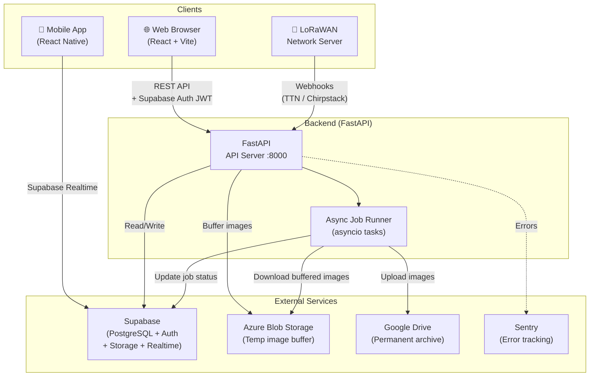
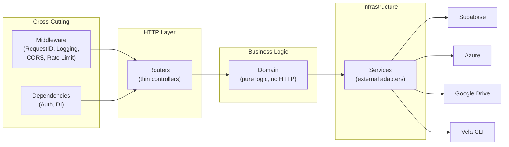
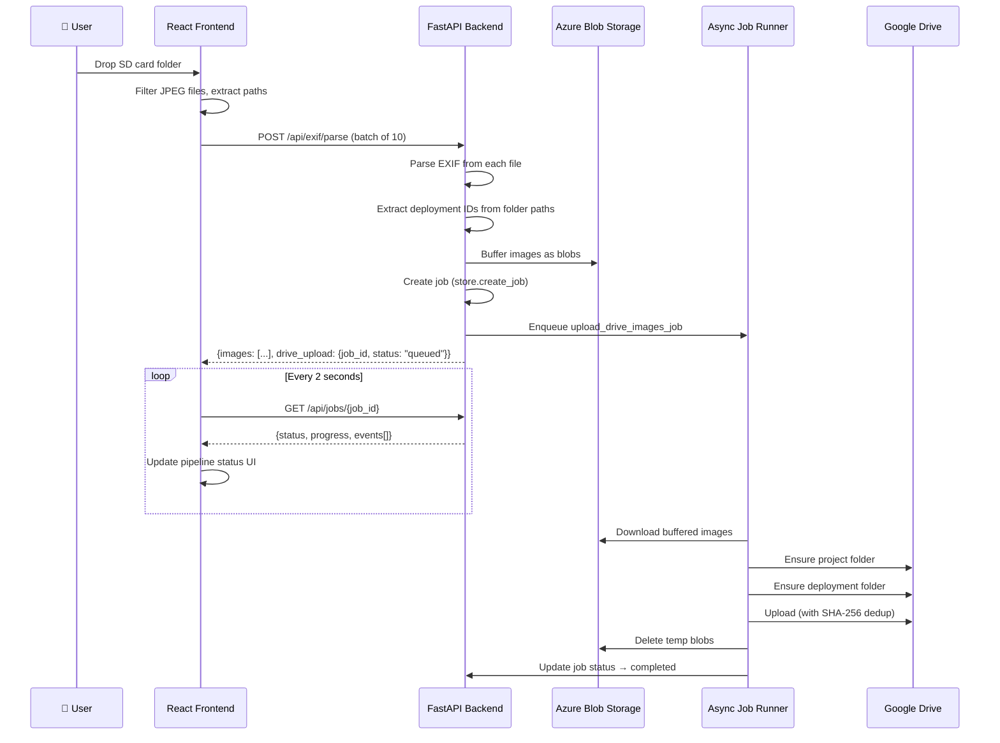
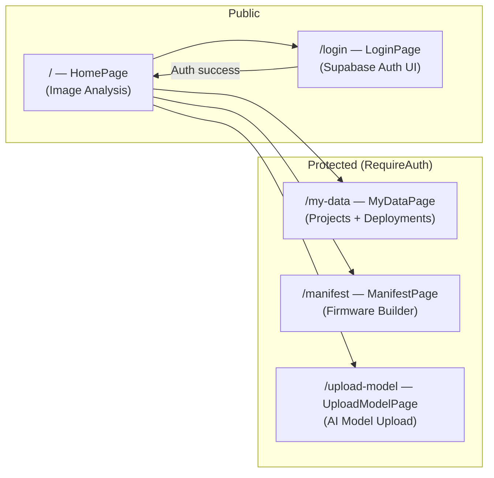
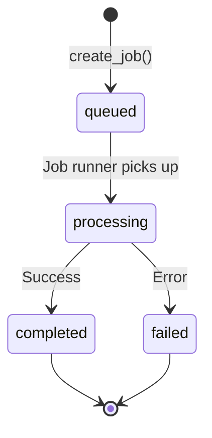

<p align="center">
  <a href="https://wildlife.ai/">
    
  </a>
</p>

<h1 align="center">
Wildlife Watcher Web
</h1>

<p align="center">
  <strong>Complete toolkit for configuring and analyzing data from Wildlife Watcher devices.</strong>
</p>

---

## Table of Contents

- [Overview](#overview)
- [System Architecture](#system-architecture)
- [Repository Structure](#repository-structure)
- [Prerequisites](#prerequisites)
- [Local Development](#local-development)
  - [1. Clone and Configure Environment](#1-clone-and-configure-environment)
  - [2. Backend Setup (FastAPI)](#2-backend-setup-fastapi)
  - [3. Frontend Setup (React/Vite)](#3-frontend-setup-reactvite)
  - [4. Verify Everything Works](#4-verify-everything-works)
- [Environment Variables Reference](#environment-variables-reference)
- [Feature Flags](#feature-flags)
- [Frontend Pages and Routes](#frontend-pages-and-routes)
- [Backend API Endpoints](#backend-api-endpoints)
- [Async Job System](#async-job-system)
- [Image Analysis → Google Drive Pipeline](#image-analysis--google-drive-pipeline)
- [LoRaWAN Integration](#lorawan-integration)
- [Deployment to Production](#deployment-to-production)
  - [Frontend Deployment (Static Hosting)](#frontend-deployment-static-hosting)
  - [Backend Deployment (Container/PaaS)](#backend-deployment-containerpaas)
  - [Production Security Checklist](#production-security-checklist)
- [Supabase Setup](#supabase-setup)
- [Testing](#testing)
- [Contributing](#contributing)
- [License](#license)

---

## Overview

The Wildlife Watcher Website is a multi-service platform that lets conservation teams:

1. **Analyse camera-trap images** — drag-and-drop SD card folders to extract EXIF metadata, match deployments, and route images to Google Drive.
2. **Convert AI models** — upload Edge Impulse ZIPs, run Vela optimisation, and register models in Supabase.
3. **Generate firmware manifests** — wrap camera configs and model binaries into `MANIFEST.zip` packages for SD card deployment.
4. **Ingest LoRaWAN telemetry** — receive real-time device data via TTN and Chirpstack webhooks.
5. **Browse project data** — view projects, deployments, GPS coordinates and export CSV.

---

## System Architecture

### High-Level Overview



### Backend Layered Architecture



### Image Upload Pipeline (Detailed)



---

## Repository Structure

```
ww-website/
├── .env.example                 # Template — copy to .env
├── .gitignore
├── docker-compose.yml           # Production Docker compose
├── docker-compose.dev.yml       # Dev overrides (hot-reload)
├── readme.md                    # ← You are here
│
├── backend/                     # FastAPI application
│   ├── app/
│   │   ├── main.py              # Entry point — CORS, lifespan, middleware
│   │   ├── config.py            # Pydantic BaseSettings — env validation
│   │   ├── dependencies.py      # Auth DI — JWT validation, Supabase clients
│   │   ├── domain/              # Pure business logic (no HTTP imports)
│   │   │   ├── exif.py          # JPEG EXIF parsing + deployment matching
│   │   │   ├── lorawan.py       # LoRaWAN uplink processing
│   │   │   ├── manifest.py      # MANIFEST.zip assembly
│   │   │   ├── model.py         # Vela conversion + upload/register
│   │   │   ├── photo_preprocessing.py  # GPS→local time, filename/folder naming
│   │   │   ├── inaturalist.py   # iNaturalist integration (Phase 6)
│   │   │   └── public_api.py    # Public API domain logic
│   │   ├── jobs/                # Async job system
│   │   │   ├── definitions.py   # Job functions (Drive upload, model convert)
│   │   │   ├── runner.py        # Local asyncio task runner
│   │   │   ├── store.py         # In-memory + Supabase job persistence
│   │   │   └── worker.py        # ARQ WorkerSettings (for container deploys)
│   │   ├── middleware/          # Request processing pipeline
│   │   │   ├── logging.py       # Structured JSON request logging
│   │   │   ├── rate_limit.py    # slowapi per-IP limits
│   │   │   └── request_id.py    # X-Request-ID propagation
│   │   ├── registries/          # Static configuration data
│   │   │   ├── camera_configs.py
│   │   │   └── model_registry.py
│   │   ├── routers/             # HTTP endpoints (thin validate + delegate)
│   │   │   ├── exif.py          # POST /api/exif/parse
│   │   │   ├── jobs.py          # GET  /api/jobs/{id}
│   │   │   ├── lorawan.py       # POST /api/lorawan/webhook/*
│   │   │   ├── manifest.py      # POST /api/manifest/generate
│   │   │   ├── models.py        # POST /api/models/convert
│   │   │   ├── public_api.py    # Public data endpoints
│   │   │   └── inaturalist.py   # iNaturalist OAuth endpoints
│   │   ├── schemas/             # Pydantic request/response models
│   │   │   ├── common.py        # ApiResponse, ApiError, ApiMeta
│   │   │   ├── job.py           # JobStatus, JobInfo, ProgressEvent
│   │   │   ├── lorawan.py       # TTNUplink, ChirpstackUplink
│   │   │   ├── manifest.py      # ManifestRequest
│   │   │   └── model.py         # ModelUpload, ModelConvert
│   │   └── services/            # Infrastructure adapters
│   │       ├── azure_storage.py # Azure Blob Storage (temp buffer)
│   │       ├── google_drive.py  # Google Drive upload + dedup
│   │       ├── supabase_client.py
│   │       ├── storage.py       # Supabase Storage upload/download
│   │       ├── http_client.py   # httpx + tenacity retry
│   │       ├── vela.py          # Ethos-U Vela CLI wrapper
│   │       ├── cache.py         # Thread-safe dict cache
│   │       ├── blob_store.py    # Legacy local temp store
│   │       ├── api_key.py       # API key management
│   │       ├── inat_oauth.py    # iNaturalist OAuth
│   │       ├── sscma.py         # SSCMA catalog
│   │       └── db_utils.py      # Paginated Supabase queries
│   ├── tests/                   # pytest test suite (51 tests)
│   ├── Dockerfile               # Multi-stage (base / dev)
│   ├── requirements.txt         # Production dependencies
│   ├── requirements-dev.txt     # Test/dev dependencies
│   └── pyproject.toml           # ruff + pytest config
│
├── frontend/                    # React + TypeScript + Vite
│   ├── src/
│   │   ├── App.tsx              # Router + Layout + Auth guard
│   │   ├── main.tsx             # React entry point
│   │   ├── pages/               # Route-level components
│   │   │   ├── HomePage.tsx     # Landing page + image analysis
│   │   │   ├── LoginPage.tsx    # Supabase Auth UI
│   │   │   ├── MyDataPage.tsx   # Projects + Deployments browser
│   │   │   ├── ManifestPage.tsx # Firmware manifest builder
│   │   │   └── UploadModelPage.tsx
│   │   ├── components/
│   │   │   ├── toolkit/         # Core feature components
│   │   │   │   ├── AnalyseImages.tsx
│   │   │   │   ├── GenerateManifest.tsx
│   │   │   │   ├── UploadModel.tsx
│   │   │   │   └── PipelineStatusBox.tsx
│   │   │   ├── auth/
│   │   │   └── common/
│   │   ├── config/
│   │   │   └── supabase.ts      # Supabase client init
│   │   ├── hooks/
│   │   │   ├── useAuth.ts       # Auth state management
│   │   │   ├── useDragAndDrop.ts
│   │   │   └── useJob.ts        # Job polling hook
│   │   ├── lib/
│   │   │   ├── apiClient.ts     # Fetch wrapper with Supabase JWT
│   │   │   └── queryClient.ts   # TanStack Query client
│   │   ├── types/
│   │   │   └── job.ts           # Job type definitions
│   │   └── styles/
│   │       └── index.css        # Global CSS variables + base styles
│   ├── vite.config.ts           # Reads .env from parent dir
│   └── package.json
│
├── docs/                        # Extended documentation
│   ├── api-reference.md
│   ├── deployment-guide.md
│   ├── lorawan-webhook-setup.md
│   └── v2-architecture-plan.md
│
└── scripts/                     # Utility scripts
```

---

## Prerequisites

| Tool | Version | Purpose |
|------|---------|---------|
| **Node.js** | 18+ | Frontend dev server and build |
| **npm** | 9+ | (Bundled with Node.js) |
| **Python** | 3.11+ | Backend runtime |
| **pip** | Latest | Python package manager |
| **Git** | Any | Version control |

**Optional (for production):**

| Tool | Purpose |
|------|---------|
| **Docker** + **Docker Compose** | Containerised deployment |
| **Vela CLI** (`ethos-u-vela`) | AI model conversion (installed via pip) |

---

## Local Development

### 1. Clone and Configure Environment

```bash
git clone https://github.com/wildlifeai/ww-website.git
cd ww-website

# Create your local environment file
cp .env.example .env
```

Edit `.env` and fill in **at minimum** the three required Supabase variables:

```env
SUPABASE_URL=https://your-project.supabase.co/
SUPABASE_ANON_KEY=eyJ...
SUPABASE_SERVICE_ROLE_KEY=eyJ...
```

> **Important:** The `.env` file lives at the **repository root** (`ww-website/.env`). Both the backend and frontend read from this single file. The Vite config (`frontend/vite.config.ts`) is configured to load env from `../` (the parent directory).

### 2. Backend Setup (FastAPI)

```bash
cd backend

# Create and activate a virtual environment
python -m venv venv
# Windows:
venv\Scripts\activate
# macOS/Linux:
source venv/bin/activate

# Install dependencies
pip install -r requirements.txt
pip install -r requirements-dev.txt   # (optional — for tests and linting)

# Start the API server with hot-reload
uvicorn app.main:app --reload --port 8000
```

The backend reads `.env` from **two locations** (in priority order):
1. `../.env` (repository root — preferred for local dev)
2. `.env` (backend directory)

Once running, verify at:
- **Swagger UI**: http://localhost:8000/docs
- **Health Check**: http://localhost:8000/health → `{"status": "ok"}`

### 3. Frontend Setup (React/Vite)

Open a **second terminal**:

```bash
cd frontend

# Install dependencies
npm install

# Start the dev server
npm run dev
```

The site will be available at **http://localhost:5173**. Hot-reload is enabled.

> **Note on environment variables:** The Vite config (`vite.config.ts`) maps root `.env` variables into the frontend:
>
> | Root `.env` Variable | Frontend `import.meta.env` |
> |---------------------|--------------------------|
> | `SUPABASE_URL` | `VITE_SUPABASE_URL` |
> | `SUPABASE_ANON_KEY` | `VITE_SUPABASE_ANON_KEY` |
> | `VITE_API_BASE_URL` | `VITE_API_BASE_URL` |
>
> You do **not** need a separate `frontend/.env.local` file during local development.

### 4. Verify Everything Works

| Check | How | Expected |
|-------|-----|----------|
| Backend running | `curl http://localhost:8000/health` | `{"status": "ok"}` |
| Frontend running | Open http://localhost:5173 | Landing page loads |
| Auth working | Click "Login" | Supabase Auth UI appears |
| API connected | Upload test images on homepage | EXIF results appear |
| Swagger docs | Open http://localhost:8000/docs | Interactive API docs |

---

## Environment Variables Reference

All variables are defined in [`backend/app/config.py`](backend/app/config.py) and validated at startup via Pydantic. Missing **required** variables → the app refuses to start.

### Required

| Variable | Description |
|----------|-------------|
| `SUPABASE_URL` | Supabase project URL (e.g. `https://xxx.supabase.co/`) |
| `SUPABASE_ANON_KEY` | Supabase anonymous/public API key |
| `SUPABASE_SERVICE_ROLE_KEY` | Supabase service-role key (bypasses RLS — keep secret!) |

### Security

| Variable | Default | Description |
|----------|---------|-------------|
| `ALLOWED_ORIGINS` | `https://wildlifewatcher.ai,http://localhost:5173` | CORS origins (comma-separated) |
| `RATE_LIMIT_PER_MINUTE` | `60` | Per-IP API rate limit |

### Google Drive Integration

| Variable | Default | Description |
|----------|---------|-------------|
| `GOOGLE_DRIVE_ENABLED` | `false` | Enable async uploads of analysed images to Google Drive |
| `GOOGLE_DRIVE_FOLDER_ID` | `1jIWV3...` | Root Google Drive folder ID for uploads |
| `GOOGLE_SERVICE_ACCOUNT_JSON` | _(empty)_ | Path to service account JSON file **or** inline JSON string |
| `GOOGLE_DRIVE_MAX_FILE_SIZE_MB` | `50` | Max file size accepted for Drive upload |

### Azure Storage (Temporary Image Buffer)

| Variable | Default | Description |
|----------|---------|-------------|
| `AZURE_STORAGE_CONNECTION_STRING` | _(empty)_ | Azure Storage connection string — required when Drive upload is enabled |
| `AZURE_STORAGE_CONTAINER_NAME` | `wildlife-watcher-uploads` | Container name in Azure Blob Storage |

### LoRaWAN Webhooks

| Variable | Default | Description |
|----------|---------|-------------|
| `LORAWAN_WEBHOOK_SECRET` | _(empty)_ | Fallback webhook secret |
| `LORAWAN_TTN_WEBHOOK_SECRET` | _(empty)_ | TTN-specific secret (takes priority) |
| `LORAWAN_CHIRPSTACK_WEBHOOK_SECRET` | _(empty)_ | Chirpstack-specific secret |

> **⚠ Security:** Empty secrets = all requests accepted. **Always** set secrets in production.

### Observability

| Variable | Default | Description |
|----------|---------|-------------|
| `SENTRY_DSN` | _(none)_ | Sentry error tracking DSN |
| `LOG_LEVEL` | `info` | Logging level (`debug`, `info`, `warning`, `error`) |

### Frontend

| Variable | Default | Description |
|----------|---------|-------------|
| `VITE_API_BASE_URL` | `http://localhost:8000` | Backend API URL used by the frontend |

### General

| Variable | Default | Description |
|----------|---------|-------------|
| `GENERAL_ORG_ID` | `b0000000-0000-0000-0000-000000000001` | Default organisation UUID |

---

## Feature Flags

Toggle functionality without code changes:

| Flag | Default | Controls |
|------|---------|----------|
| `FF_INAT_ENABLED` | `false` | iNaturalist integration endpoints |
| `FF_ML_ENABLED` | `false` | ML-assisted classification |
| `FF_CLUSTERING_ENABLED` | `false` | ML clustering |
| `FF_LORAWAN_WEBHOOKS_ENABLED` | `true` | LoRaWAN webhook ingestion |
| `FF_PUBLIC_API_ENABLED` | `false` | Public data API (`/api/v1/*`) |

---

## Frontend Pages and Routes



| Route | Component | Auth | Description |
|-------|-----------|------|-------------|
| `/` | `HomePage` | No | Landing page with drag-and-drop image analysis |
| `/login` | `LoginPage` | No | Supabase Auth UI (GitHub + Google OAuth) |
| `/my-data` | `MyDataPage` | Yes | Browse projects, deployments with sorting, search, CSV export |
| `/manifest` | `ManifestPage` | Yes | Configure and generate firmware MANIFEST.zip |
| `/upload-model` | `UploadModelPage` | Yes | Upload Edge Impulse ZIPs for Vela conversion |

---

## Backend API Endpoints

| Method | Path | Auth | Description |
|--------|------|------|-------------|
| `GET` | `/health` | No | Health probe for Docker/load balancer |
| `POST` | `/api/exif/parse` | No | Parse EXIF, optionally enqueue Drive upload |
| `GET` | `/api/jobs/{id}` | No | Poll async job status + progress events |
| `POST` | `/api/manifest/generate` | Yes | Generate MANIFEST.zip for SD card |
| `POST` | `/api/models/convert` | Yes | Convert Edge Impulse model via Vela |
| `POST` | `/api/lorawan/webhook/ttn` | Secret | TTN v3 uplink webhook |
| `POST` | `/api/lorawan/webhook/chirpstack` | Secret | Chirpstack v4 uplink webhook |
| `*` | `/api/v1/*` | API Key | Public API (when `FF_PUBLIC_API_ENABLED=true`) |
| `*` | `/api/inat/*` | Yes | iNaturalist OAuth flow (when `FF_INAT_ENABLED=true`) |

Full API docs are auto-generated at http://localhost:8000/docs (Swagger) and http://localhost:8000/redoc (ReDoc).

See also: [`docs/api-reference.md`](docs/api-reference.md).

---

## Async Job System

The backend runs heavy tasks (model conversion, Drive uploads) as **in-process asyncio background tasks**. No Redis or separate worker container is required for local development.



### Job Lifecycle

| Status | Description |
|--------|-------------|
| `queued` | Created, waiting for runner |
| `processing` | Actively executing |
| `completed` | Success — result available |
| `completed_with_errors` | Partial success (some files failed) |
| `failed` | Error — details in `error` field |

### Persistence

- **Fast path:** In-memory dict (`_memory_store` in `jobs/store.py`)
- **Durable path:** Async sync to Supabase `api_jobs` table
- **Startup recovery:** On boot, any `processing` jobs in Supabase are marked `failed` (server crash recovery)

### Frontend Polling

The frontend polls `GET /api/jobs/{id}` every 2 seconds. The response includes structured `events[]` with monotonic sequence numbers for reliable incremental consumption.

---

## Image Analysis → Google Drive Pipeline

This is the core workflow for processing SD card images:

### Google Drive Folder Structure

Images are preprocessed before upload — filenames are converted to **local time** (derived from GPS coordinates) and deployment folders use a **human-readable naming convention**:

```
📁 <Root Drive Folder>
├── 📂 {project-slug}_{project_id[:8]}
│   └── 📂 {YYYYMMDD}_{duration}_{location}
│       ├── 📸 20260113233000_01.jpg    ← local time, sequence 01
│       └── 📸 20260113233000_02.jpg    ← same second, sequence 02
└── 📂 monitoring-weta_b1234567
    └── 📂 20260113_2d21h41m22s_highhill
        └── 📸 ...
```

**Folder naming:**
- `YYYYMMDD` — start date of the deployment
- Duration — e.g. `2d21h41m22s` (days, hours, minutes, seconds), or `ongoing` if not ended
- Location — deployment location name, lowercase, no spaces

**Filename naming:**
- `YYYYMMDDHHMMSS` — photo timestamp in **local time** (UTC adjusted by GPS timezone)
- `_XX` — sequence number for multiple photos in the same second (burst mode)

### Deduplication

Files are deduplicated using SHA-256 hashes stored as Google Drive `appProperties`. The hash combines file content + deployment ID, so identical images in different deployments are stored separately.

### SD Card Folder Convention

The firmware writes images to SD card with this structure:

```
MEDIA/
└── 655BC4E5/            ← 8-char deployment ID prefix (hex)
    └── IMAGES.000/
        ├── 9DB650A0.JPG  ← Hex-encoded timestamp filename
        └── 9DB650B0.JPG
```

The backend extracts deployment IDs from these folder paths and resolves the 8-char prefix to a full UUID via Supabase lookup.

---

## LoRaWAN Integration

```mermaid
graph LR
    Camera["📷 Camera"] --> LoRa["📡 LoRa Radio"]
    LoRa --> GW["🗼 Gateway"]
    GW --> NS["Network Server<br/>(TTN / Chirpstack)"]
    NS -- "HTTP Webhook" --> API["FastAPI<br/>/api/lorawan/webhook/*"]
    API --> Parse["Parse binary payload"]
    Parse --> Match["Match device by EUI"]
    Match --> Deploy["Find active deployment"]
    Deploy --> Store["Insert into Supabase<br/>(lorawan_messages +<br/>lorawan_parsed_messages)"]
    Store --> RT["Supabase Realtime<br/>(auto-broadcast<br/>to mobile app)"]
```



### Binary Payload Format

| Byte | Field | Range | Description |
|------|-------|-------|-------------|
| 0 | Battery Level | 0–100 | Battery percentage |
| 1 | SD Card Usage | 0–100 | SD card capacity used % |
| 2+ | Model Output | variable | AI inference results |

See: [`docs/lorawan-webhook-setup.md`](docs/lorawan-webhook-setup.md)

---

## Deployment to Production

### Frontend Deployment (Static Hosting)

The frontend builds to static files — deploy to any CDN/static host:

```bash
cd frontend
npm run build   # TypeScript check + Vite build → dist/
```

**Recommended hosts:**

| Host | How |
|------|-----|
| **Cloudflare Pages** | Connect repo → set build command `npm run build`, output dir `frontend/dist` |
| **Vercel** | `vercel --cwd frontend` |
| **Nginx** | Copy `dist/` to web root, configure SPA fallback |

> **Critical:** Set the `VITE_API_BASE_URL` build variable to your production backend URL (e.g. `https://api.wildlifewatcher.ai`).

### Backend Deployment (Container/PaaS)

#### Option A: Docker Compose (Full Stack)

```bash
cp .env.example .env
# Edit .env with production values

docker compose up -d --build

# Verify
curl http://localhost:8000/health
```

#### Option B: Render Blueprint (Recommended for PaaS)

See [`docs/deployment-guide.md`](docs/deployment-guide.md) for step-by-step Render, VPS, and manual deployment instructions.

#### Option C: Direct (no Docker)

```bash
cd backend
pip install -r requirements.txt
uvicorn app.main:app --host 0.0.0.0 --port 8000 --workers 2
```

### Production Security Checklist

> **⚠ Do NOT deploy without verifying these items.**

- [ ] `.env` file is **not** committed to Git (verify `.gitignore`)
- [ ] `SUPABASE_SERVICE_ROLE_KEY` is kept secret (never exposed to frontend)
- [ ] `ALLOWED_ORIGINS` is set to your **exact** production frontend domain(s)
- [ ] `LORAWAN_WEBHOOK_SECRET` / per-server secrets are **non-empty**
- [ ] `LOG_LEVEL` is set to `info` (not `debug` — debug can log sensitive data)
- [ ] `SENTRY_DSN` is configured for error tracking
- [ ] `GOOGLE_SERVICE_ACCOUNT_JSON` is excluded from Git (see `.gitignore`)
- [ ] `AZURE_STORAGE_CONNECTION_STRING` is set if Drive uploads are enabled
- [ ] Backend is behind HTTPS (reverse proxy or PaaS handles TLS)
- [ ] `RATE_LIMIT_PER_MINUTE` is tuned for expected traffic
- [ ] Supabase RLS policies are reviewed and enabled on all tables
- [ ] `backend/service-account.json` is **not** committed (listed in `.gitignore`)

---

## Supabase Setup

The backend expects these Supabase resources:

### Storage Buckets

| Bucket | Purpose | Public |
|--------|---------|--------|
| `firmware` | Config firmware, manifest results | No |
| `ai-models` | AI model ZIPs | No |

### Database Tables

| Table | Used By | Access |
|-------|---------|--------|
| `projects` | Frontend, EXIF matching | RLS |
| `deployments` | EXIF matching, Drive folder org | RLS + service-role |
| `devices` | LoRaWAN (device lookup by EUI) | RLS + service-role |
| `ai_models` | Model domain (register/update) | RLS + service-role |
| `firmware` | Manifest domain | RLS + service-role |
| `lorawan_messages` | LoRaWAN raw store | service-role only |
| `lorawan_parsed_messages` | LoRaWAN parsed data | service-role only |
| `api_jobs` | Job persistence + recovery | service-role only |

### Auth Providers

Configure in Supabase Dashboard → Authentication → Providers:
- **GitHub** OAuth
- **Google** OAuth

### Realtime

Enable Realtime on `lorawan_parsed_messages` for live mobile app updates:
1. Supabase Dashboard → Database → Replication
2. Toggle on `lorawan_parsed_messages`

---

## Testing

```bash
cd backend

# Run all tests
python -m pytest tests/ -v

# Run a specific test file
python -m pytest tests/test_exif_domain.py -v

# Run with coverage
python -m pytest tests/ --cov=app --cov-report=term-missing
```

| Test File | Tests | Coverage |
|-----------|-------|----------|
| `test_exif_domain.py` | 14 | JPEG parsing, deployment ID extraction, GPS matching |
| `test_lorawan_domain.py` | 16 | Payload parsing, schema validation, webhook secrets |
| `test_manifest_domain.py` | 7 | C hex array parsing, directory flattening |
| `test_model_domain.py` | 9 | ZIP name parsing, label extraction, 8.3 filenames |
| `test_routers.py` | 5 | Health check, OpenAPI schema, smoke tests |

---

## Contributing

### Code Style

| Area | Tool | Config |
|------|------|--------|
| Python formatting | [ruff](https://docs.astral.sh/ruff/) | `pyproject.toml` (line length 100) |
| Python type hints | Required on all public functions | — |
| Frontend linting | ESLint | `eslint.config.js` |
| Frontend types | TypeScript strict | `tsconfig.app.json` |

```bash
# Backend
cd backend
ruff check app/
ruff format app/

# Frontend
cd frontend
npm run lint
```

### Adding a New Feature

1. **Schema** → Define Pydantic models in `backend/app/schemas/`
2. **Domain** → Implement business logic in `backend/app/domain/` (no HTTP!)
3. **Router** → Create thin endpoint in `backend/app/routers/` (validate → delegate)
4. **Register** → Import and include the router in `backend/app/main.py`
5. **Test** → Add tests in `backend/tests/`
6. **Frontend** → Add component in `frontend/src/components/toolkit/`, wire into a page

### Commit Convention

Use [Conventional Commits](https://www.conventionalcommits.org/): `feat:`, `fix:`, `docs:`, `refactor:`, `test:`, `chore:`.

---

## 👥 Contributors

- Tobyn Packer
- Victor Anton

## 📜 License

This project is licensed under the **GPL-3.0 License** — see the [`LICENSE`](LICENSE) file for details.